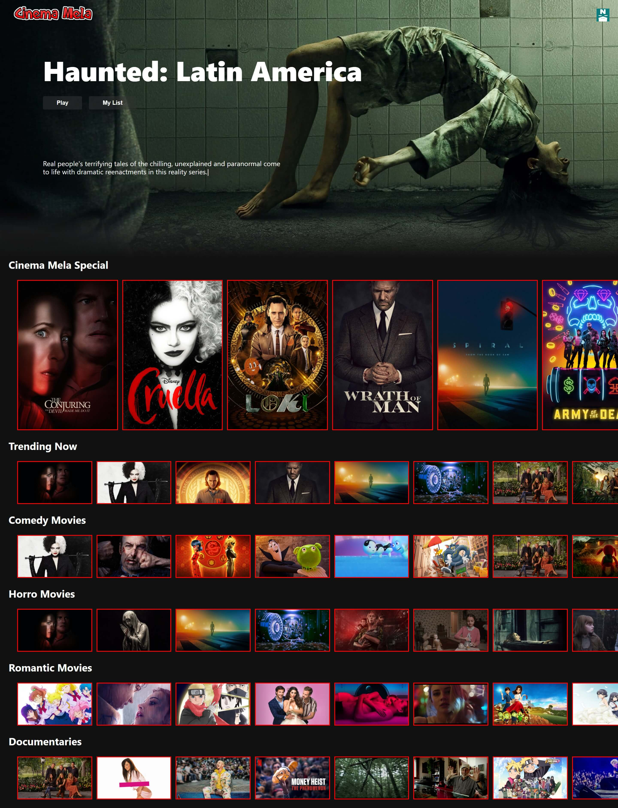
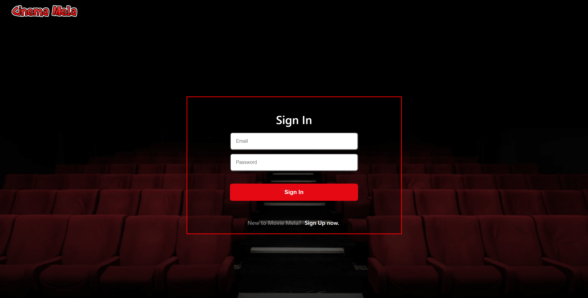
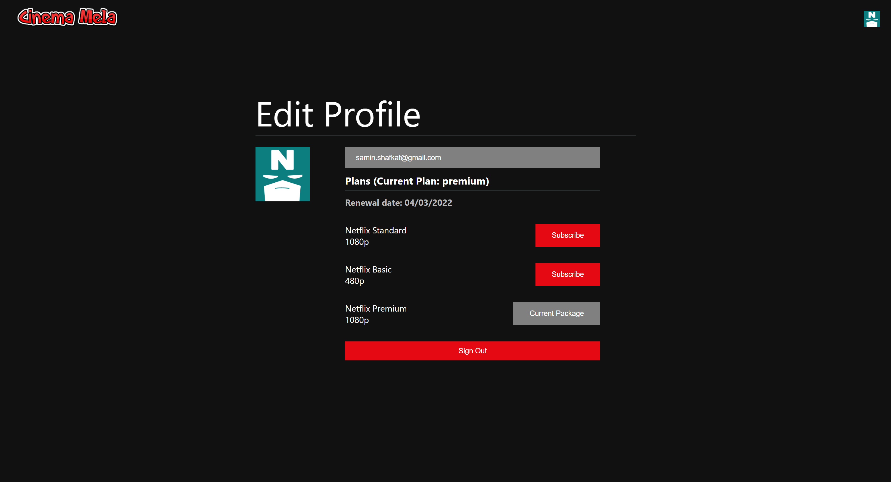
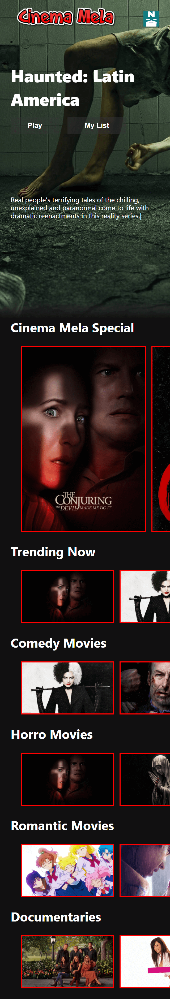

# MOVIE MELA WEBSITE
This is a website of movies where user needs to be authenticated to see the upcoming movie. For movie data I have used TMDB API. I have used Redux for practice purpose and used it for storing users details 

- users need to authenticated to get access to the website.
- TMDB API is used for data sources.
- Redux is used for user details storage.

 

:round_pushpin: [LiveSite Link](https://ghuri-movie-website.web.app "CLICK ME")

 

Frontend github: [Code Link](https://github.com/Samin1615088/ghuri-movie-website-redux)
### :point_down: Home page: 

### :point_down: Subscription page: 

### :point_down: Login page: 

### :point_down: Profile Edit page: 

### :point_down: Screenshot of my (mobile) responsive functional home page:
 

## Technologies Used For 

### Frontend
`REACT ROUTER`  `RAW CSS`  `REACT FORM HOOK`  `USECONTEXT HOOK`  `USESTATE HOOK`  `FONT AWESOME` `REDUX` 

###  Backend
`FIREBASE DATABASE` `FIREBASE AUTHENTICATION`  `FIREBASE HOSTING`
